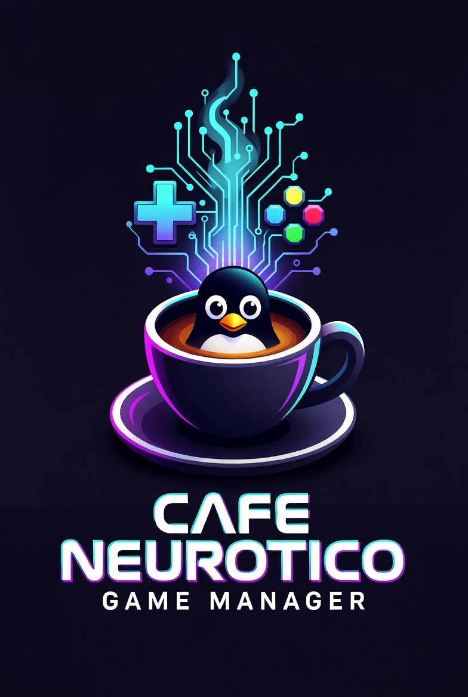
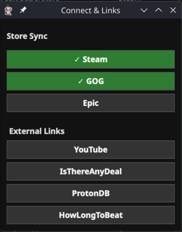
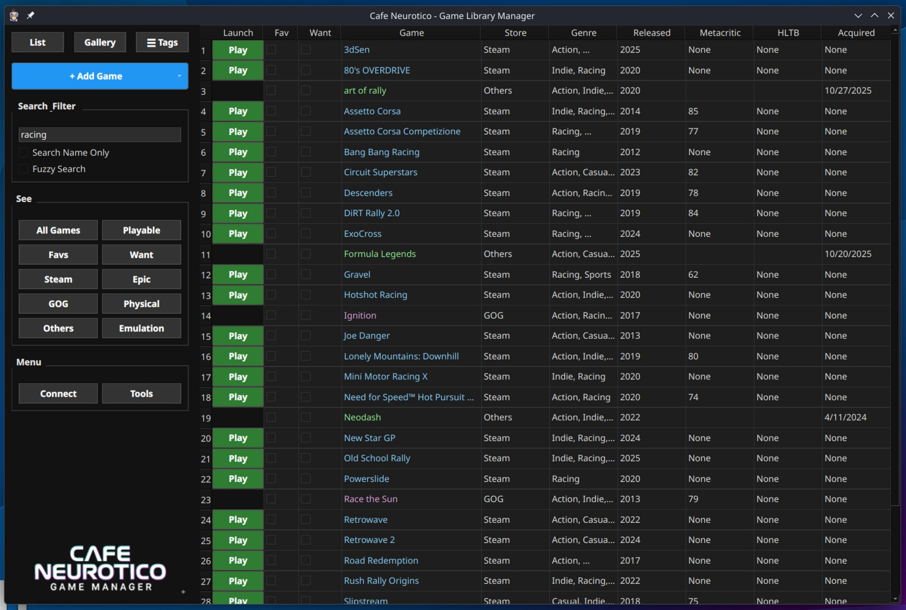
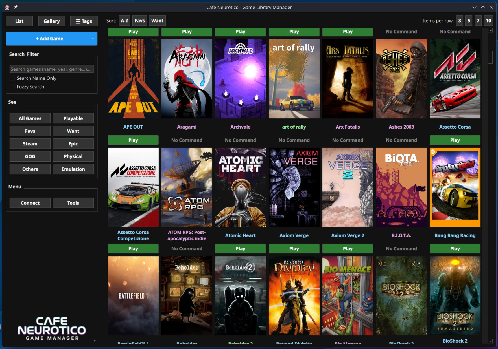
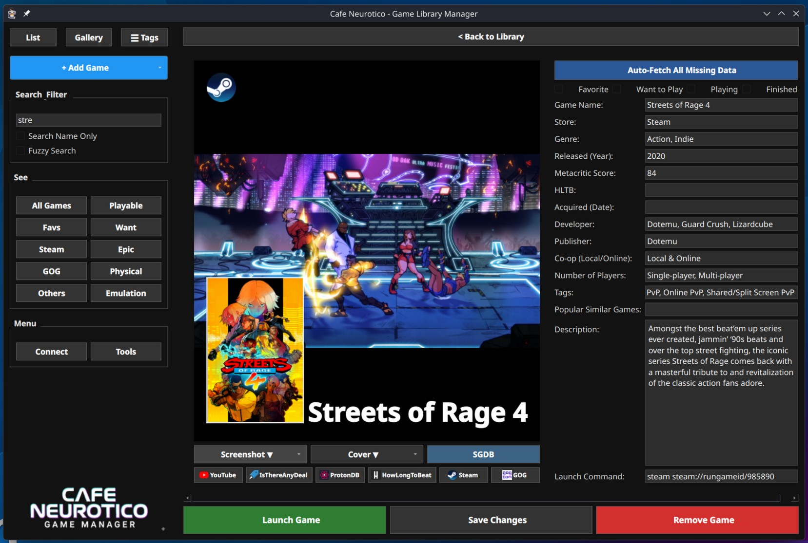
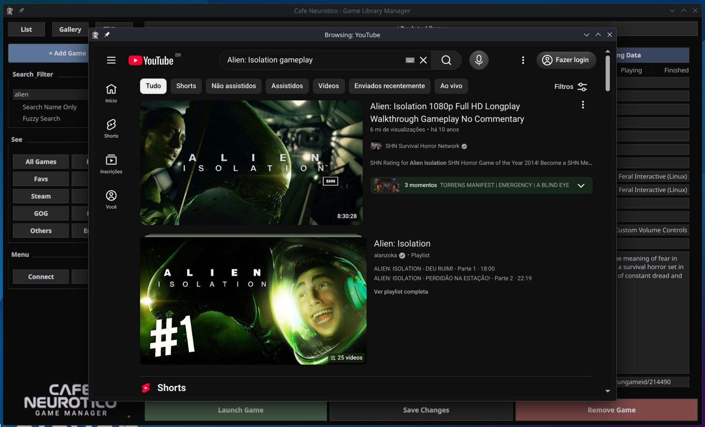
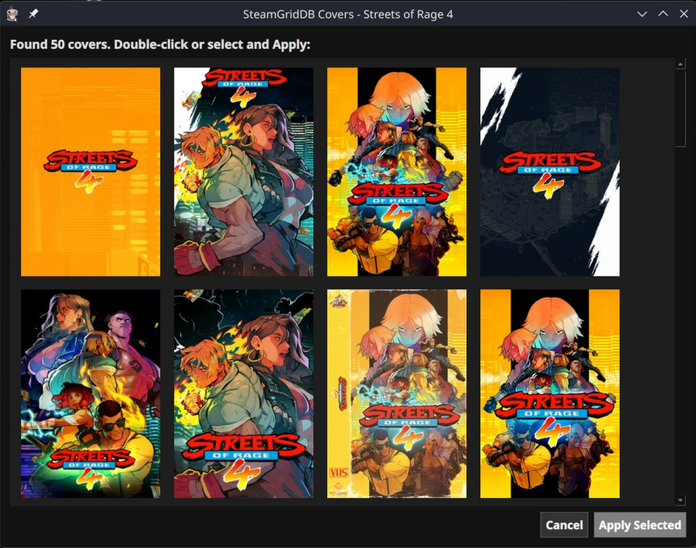

  

  # CAFE NEUROTICO
  **SYS_MANUAL_V1.0 // INITIALIZATION**

---

## 🛑 INTRODUCTION: THE MANIFESTO

**YOUR LIBRARY. MANAGEABLE. SEARCHABLE. PORTABLE. BACKUPABLE.**
*(Wait, is that even a word?)*

Are you neurotic, even obsessive about your library? Data, Year, Genre, Tags... I am! Want to have full control of it? Search it? Edit it? Hell yeah!

* Want to import your whole Steam or GOG library? **Do it!**
* Don't want to import your whole library? Add game by game (Automated or Manually).
* Want to be able to customize every piece of info about the game, even images easily? Done.
* Want to batch import a lot of games at once but they don't belong to any library? The app will generate a Template CSV file that you can edit and save in any Excel-style app, and then import it easily.
* Want to be able to check Youtube videos (logged in or not), IsThereAnyDeal, HowLongToBeat, ProtonDB, and store pages about that game?

I've avoided menus as much as possible. I want to be able to see anything I need right there on the screen, in any of the views, so don't expect any long menus here, there's almost nothing.

---

## 1. QUICK START: INITIALIZE YOUR ARSENAL

Before we dive in, let's get a few technical disclaimers out of the way. **This app can be heavy.** It contains a full-fledged Chromium-based web browser, responsible for importing libraries and for navigation. Also, cover images in gallery view consume RAM, so keep those things in mind.

All data is stored in a **single folder** created in the same folder as the app. Only one. Right there. No searching around the system in a sea of config folders.

### Connecting Your Stores
Want to import your whole Steam or GOG library? Hit the **Connect** button in the Menu sector on the left.

* **STEAM:** Input your SteamID64 and API key. Boom. The system grabs your library and injects the launch commands automatically.
* **GOG:** Logs you in through the internal browser, scrapes your owned assets, and pulls them in.
* **EPIC:** They hate bots. So use the Import CSV tool in the Tools menu after exporting from GOG Galaxy or Heroic..

> **⚠️ ATTENTION: EXECUTION PROTOCOL**
> It's not a launcher per se. You still need Steam, Heroic, or whatever you use to launch your games, since it will execute the command you provide. Anything goes, I mean, you can open your calculator app if you wish so.

---

## 2. VISUAL RECON: THE THREE VIEWS

There are 3 views: List, Gallery, and Detailed. The left sidebar remains your constant command center for filtering and searching.

### The List View
For the true data obsessive. A high-density spreadsheet showing you everything at a glance.

### The Gallery View
All about the cover art. A highly visual, grid-based layout. *(Remember the manifesto: Loading a massive grid of high-res covers consumes RAM. You have been warned.)*

---

## 3. DETAILED VIEW: FULL OVERRIDE

Double-click any entry to enter the Detailed View. Prepare to insert some data manually (or not, if you don't care, that's okay too), like the **date of purchase**.

### External Intel & Internal Browser
Because the app contains a full-fledged Chromium-based web browser, clicking the external links doesn't kick you out to your desktop browser. It opens a secure internal window to verify gameplay footage or check Linux compatibility without leaving the command center.

---

## 4. AUTOMATED SCRAPING & TOOLS

If you just added a blank entry, hit **✨ Auto-Fetch All Missing Data** to scrape the network for developer info, tags, and official artwork. 

If you have your free SteamGridDB API key loaded, hit the **SGDB** button under the cover art to pull down the highest-rated custom covers for your exact game.

### Total System Backup
After doing all that (and more), you can create a complete backup, everything included, in a single `.zip` file, and when installing on another machine, just recover it from within the app.

---

## 🤖 SYSTEM ORIGIN: HUMAN BRAIN + MACHINE

**FULL DISCLOSURE:** I am an architect, not a traditional developer. Every single line of code in Cafe Neurotico was generated, assembled, and debugged using advanced AI assistance (specifically Google's Gemini). 

I provided the neurotic vision, the logic, and the UI/UX design. The AI wrote the Python syntax. If you dig into the source code and find unconventional architecture or weird redundancies, that is the machine learning at work. 

Feel free to fork it, refactor it, or laugh at it.

> **Developer's Note:** This application was 100% conceptualized by a human and 100% coded by AI. Built to solve a personal obsession with library management.

  <strong>/// END OF FILE ///</strong> 
  SYSTEM OPERATIONS CONCLUDED. 
  NOW GO PLAY SOME GAMES.

